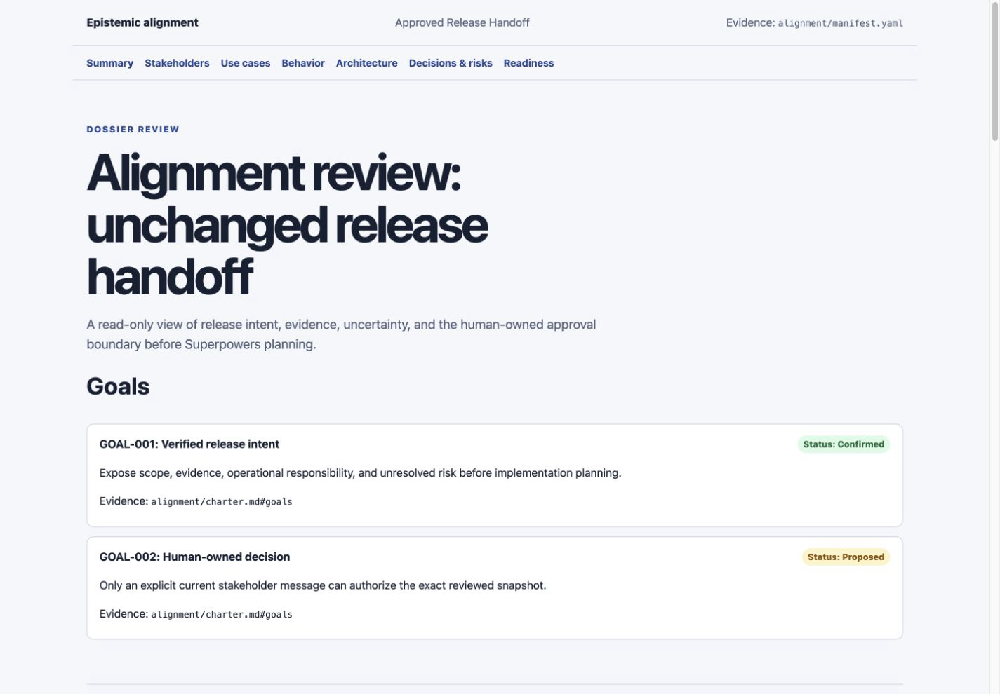

# Epistemic Alignment

[](#what-is-in-the-plugin)
[](pyproject.toml)
[](LICENSE)
[](https://github.com/netsky-prod/epistemic-alignment/stargazers)

**Stop coding the wrong product.**

Epistemic Alignment is a risk-calibrated agent workflow that establishes a
shared, inspectable understanding of a software initiative before
implementation planning begins. It separates evidence from assumptions, asks
one material question at a time, exposes disagreement while it is still cheap
to resolve, and hands the accepted model to the implementation workflow.

It is not a requirements-document factory. Small, clear work stays small. The
full workflow activates only when ambiguity, architecture, stakeholder
conflict, trust boundaries, migration, or failure cost justify it.

```text
request -> risk calibration -> material questions only
        -> use cases / BDD / C4 / ADRs only when useful
        -> independent semantic review -> stakeholder decision
        -> implementation handoff with matching rigor
```

## See the result

The plugin can turn the alignment dossier into a read-only stakeholder review
surface. The human decision still happens explicitly in the host conversation;
the Site never approves itself.

[](assets/site-desktop.png)

## Install from GitHub

Add this repository as a Codex plugin marketplace:

```sh
codex plugin marketplace add netsky-prod/epistemic-alignment
```

Then open Codex, run `/plugins`, choose **Epistemic Alignment**, and install
**Alignment**. Start a new task so the bundled skills are discovered.

Ask the agent:

> Use alignment:align-project to align this initiative before implementation
> planning.

If the workflow saves you from one expensive misunderstanding,
[star the repository](https://github.com/netsky-prod/epistemic-alignment) so
other agent builders can find it.

For local development, reinstall, and removal, see the
[installation guide](docs/installation.md).

## What it catches

- Stakeholders using the same term for different concepts.
- An architectural choice silently presented as a product requirement.
- Happy-path acceptance criteria with missing authorization or failure paths.
- A proposed assumption that has drifted into an alleged fact.
- Responsibilities that fall between systems, teams, or trust boundaries.
- Approval that no longer matches the artifacts being handed to implementation.

## How much process does it use?

The front-door skill writes a short process contract and recommends one of four
levels:

| Level | Use it for | Result |
| --- | --- | --- |
| `direct` | Bounded, already-understood work | Explain the rationale and proceed without a dossier |
| `bounded` | One or two material uncertainties | Create only the artifacts needed to resolve them |
| `full` | Cross-cutting product and architecture work | Run the justified discovery, behavior, architecture, review, and approval phases |
| `critical` | High-cost, regulated, or difficult-to-reverse decisions | Add explicit provenance and exact-snapshot binding where genuinely required |

Before every phase, the agent must name the decision it will resolve or the
material risk it will reduce. If it cannot, the phase is skipped.

## What is in the plugin

- `alignment:align-project` — calibrates risk and routes the workflow.
- `alignment:discover-domain` — separates observed facts, stakeholder claims,
  inferences, assumptions, contradictions, and open questions.
- `alignment:write-use-cases` — captures actor goals with Cockburn use cases.
- `alignment:specify-behavior` — writes observable BDD/Gherkin examples.
- `alignment:model-architecture` — explains responsibilities with C4 and ADRs.
- `alignment:review-alignment` — performs an independent cross-artifact review.
- `alignment:build-review` — creates the stakeholder-facing review surface.
- `alignment:approve-handoff` — records the human decision and prepares the
  downstream handoff.

The canonical artifacts are portable Markdown, Gherkin, Mermaid, and ADRs.
Adapter guidance is included for Codex, Claude, OpenCode, and Qwen Code; the
packaged marketplace installation currently targets Codex.

## Example output

A completed exact-snapshot example lives in
[`examples/approved-project/`](examples/approved-project/). A normal run does
not require hashes: conversational approval is the default. The dependency-free
Python helper exists for cases where approval must bind to exact bytes.

```sh
scripts/alignment init <project-root> --project-id <id> --title <title>
scripts/alignment snapshot <project-root> --json
scripts/alignment issue-review <project-root> \
  --adapter codex-sites --status presented --location alignment-review/site
scripts/alignment decide <project-root> \
  --decision approved --reviewer <label> --provenance human-message \
  --review-hash <exact-issued-hash>
scripts/alignment check <project-root> --json
scripts/alignment handoff <project-root>
```

The helper proves snapshot and process integrity. It does not prove semantic
correctness or reviewer identity.

## Documentation

- [Installation, reinstall, and removal](docs/installation.md)
- [Workflow and command usage](docs/usage.md)
- [Recovery and restartability](docs/recovery.md)
- [Trust boundary and limitations](docs/trust-model.md)
- [Renderer contract and future adapters](docs/adapters.md)
- [Release history](CHANGELOG.md)

Epistemic Alignment is released under the [MIT License](LICENSE).
