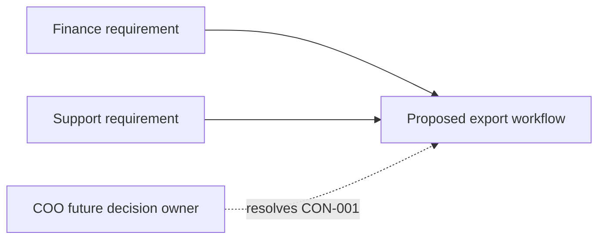

---
{"artifact":"context","entities":[]}
---
# Context

The proposed export workflow interacts with Finance and Support policy
stakeholders. The policy boundary is unresolved: Finance requires
irreversibility, while Support requires a cancellation window. The COO is the
future decision owner. This is a context proposal, not a settled architecture.

Textual fallback: Finance and Support both constrain the export workflow; the
COO is expected to resolve the conflict before implementation.
