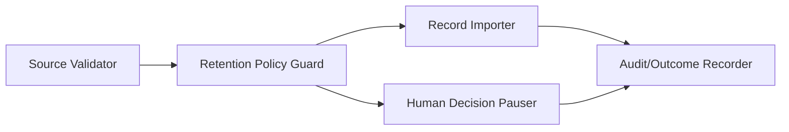

---
{"artifact":"components","entities":["C4-COMPONENTS","UC-001","SCN-001","SCN-002","SCN-003","UQ-001"]}
---
# Components

| Element | Responsibility | Supports | Open concern |
| --- | --- | --- | --- |
| Source Validator | Check agreed source and authorization rules | SCN-001, SCN-003 | Rules are UQ-002/UQ-003 |
| Retention Policy Guard | Require a confirmed policy before durable write | SCN-001, SCN-002 | Must not invent UQ-001 |
| Record Importer | Persist accepted records under policy metadata | SCN-001 | Exact storage/deletion semantics proposed |
| Human Decision Pauser | Make unknown policy visible and recoverable | SCN-002 | Decision remains with policy owner |
| Audit/Outcome Recorder | Record outcome without certifying approval | SCN-001–003 | Audit lifecycle is unresolved |

All components are proposed responsibilities, not settled implementation design.
