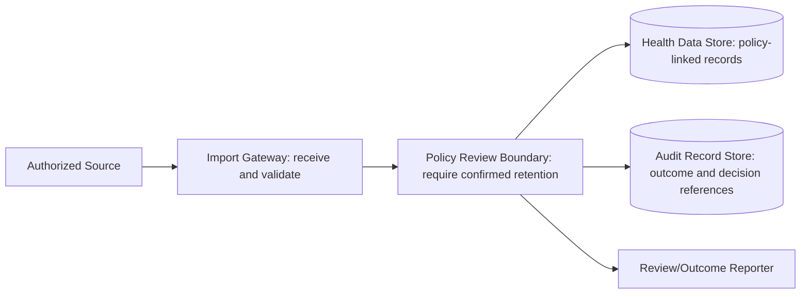

---
{"artifact":"containers","entities":["C4-CONTAINERS","UC-001","SCN-001","SCN-002","SCN-003","UQ-001"]}
---
# Containers

| Element | Responsibility | Supports | Open concern |
| --- | --- | --- | --- |
| Import Gateway | Receive and validate source data | SCN-001, SCN-003 | UQ-002 defines format/rules |
| Policy Review Boundary | Block durable persistence while UQ-001 is unknown | SCN-001, SCN-002 | Exact policy is not decided |
| Health Data Store | Store only policy-governed records | SCN-001 | Retention/deletion lifecycle is UQ-001 |
| Audit Record Store | Preserve reviewable outcome references | SCN-001, SCN-002 | Audit lifecycle is part of UQ-001/UQ-003 |
| Review/Outcome Reporter | Expose success, pause, or recovery guidance | UC-001 / SCN-001–003 | Proposed responsibility |
