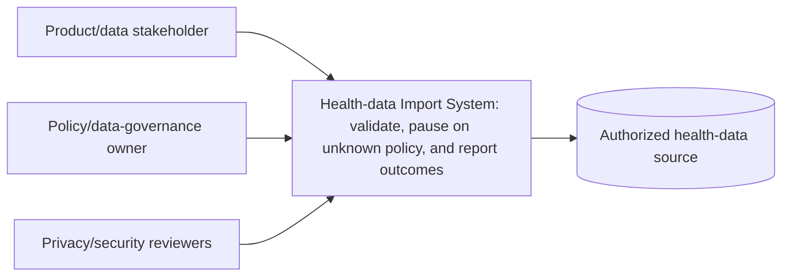

---
{"artifact":"context","entities":["C4-CONTEXT","UC-001","SCN-001","SCN-002","SCN-003","UQ-001"]}
---
# Context

| Element | Responsibility | Supports | Open concern |
| --- | --- | --- | --- |
| Product/data stakeholder | Request and review import outcome | UC-001 / SCN-001–003 | Source scope is UQ-002 |
| Policy/data-governance owner | Decide retention policy | UC-001 / SCN-002 | UQ-001 is unresolved and human-owned |
| Health-data Import System | Validate, pause safely, and report | UC-001 / SCN-001–003 | Proposed; not an implementation commitment |
| Privacy/security reviewers | Review consent, access, and audit constraints | UC-001 | INFER-001 and UQ-003 need confirmation |
