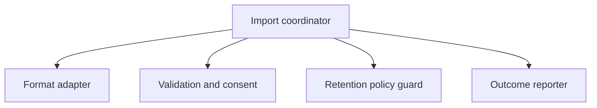

# Component view (proposed boundary)

| Component | Responsibility | Supports | Open concern |
| --- | --- | --- | --- |
| Format adapter | Converts one approved source to canonical records | UC-001 / SCN-001, SCN-003 | Exact source contract is unknown (`UQ-002`) |
| Validation and consent | Applies schema, authorization, and consent checks | UC-001 / SCN-001–003 | Policy owner/security review required (`UQ-003`) |
| Retention policy guard | Prevents storage without an explicit health-data retention policy | UC-001 / SCN-002 | No duration or deletion rule exists (`UQ-001`) |
| Outcome reporter | Reports accepted, rejected, or blocked outcomes | UC-001 / SCN-001–003 | Error/retry wording remains to be agreed |
