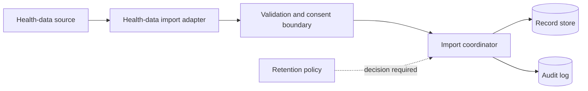

# Container view (proposed)

| Container | Responsibility | Supports | Open concern |
| --- | --- | --- | --- |
| Health-data import adapter | Accept an agreed source format and normalize input | UC-001 / SCN-001, SCN-003 | Format remains open (`UQ-002`); proposed |
| Validation and consent boundary | Validate records and enforce authorization/consent | UC-001 / SCN-001–003 | Consent/access rules open (`UQ-003`); proposed |
| Import coordinator | Coordinate confirmation, persistence, reporting, and policy check | UC-001 / SCN-001–003 | Must block durable storage while `UQ-001` is open |
| Record store | Store records only under an approved retention policy | UC-001 / SCN-001 | Existing 30-day behavior is not a health-data decision |
| Audit log | Preserve import/security events as required | UC-001 / SCN-001–003 | Retention and access for audit events open |
