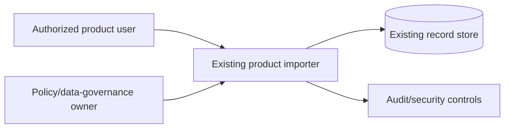

# System context

| Element | Responsibility | Supports | Open concern |
| --- | --- | --- | --- |
| Authorized product user | Requests and confirms an import | UC-001 / SCN-001, SCN-002 | Authorization/consent rules are open (`UQ-003`) |
| Existing product importer | Validates and coordinates the import | UC-001 / SCN-001–003 | Current CSV behavior is a fact; health-data handling is proposed |
| Policy/data-governance owner | Decides retention and deletion | UC-001 / SCN-002 | Critical unresolved `UQ-001` |
| Existing record store | Persists records under approved policy | UC-001 / SCN-001 | Health-data storage controls are not established |
| Audit/security controls | Records relevant security/audit events | UC-001 / SCN-001–003 | Scope and access rules open (`UQ-003`) |
