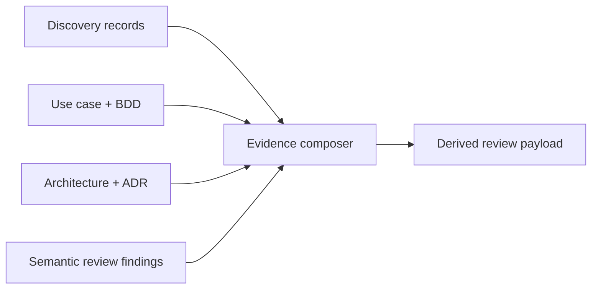

---
{"artifact":"components","entities":[]}
---
# Components

| Component | Responsibility | Supports | Open concern |
| --- | --- | --- | --- |
| Discovery records | Keep statements, inferences, assumptions, and questions distinct | `UC-001` | Billing owner is not identified |
| Evidence composer | Link canonical files and preserve labels in the derived payload | `SCN-001` | Must not turn proposals into facts |
| Snapshot binding | Expose the exact `sha256-v1` digest and paths | `SCN-001`, `SCN-002` | Integrity only; no semantic judgment |
| Review findings panel | Show human findings before readiness state | `SCN-001` | Findings require human disposition |
