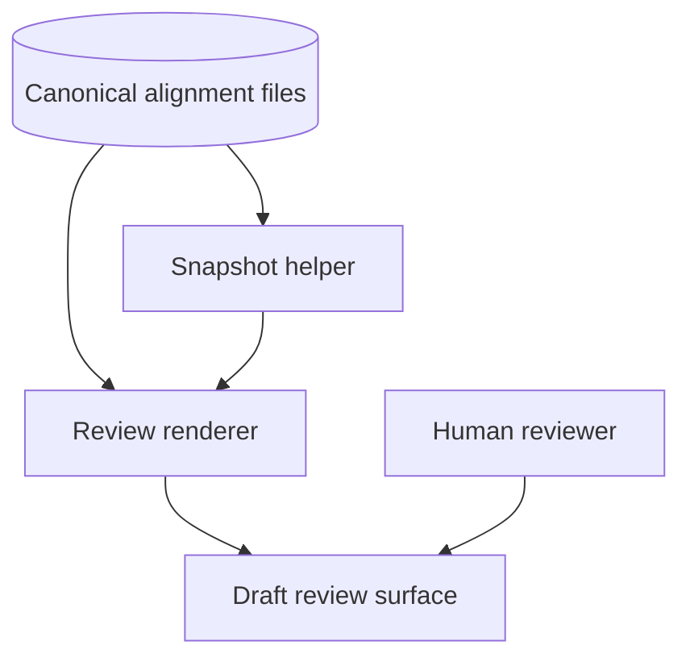

---
{"artifact":"containers","entities":[]}
---
# Containers

| Container | Responsibility | Supports | Open concern |
| --- | --- | --- | --- |
| Canonical alignment files | Store discovery, use case, BDD, architecture, and review evidence | `UC-001` | Billing source and owner remain unknown |
| Snapshot helper | Hash exactly the manifest-listed files | `SCN-001`, `SCN-002` | Hash does not judge semantics |
| Review renderer | Derive stakeholder-facing payload from dossier | `SCN-001` | Must preserve uncertainty and findings |
| Draft review surface | Read-only presentation of payload and digest | `SCN-001` | Must not write decisions or publish |
