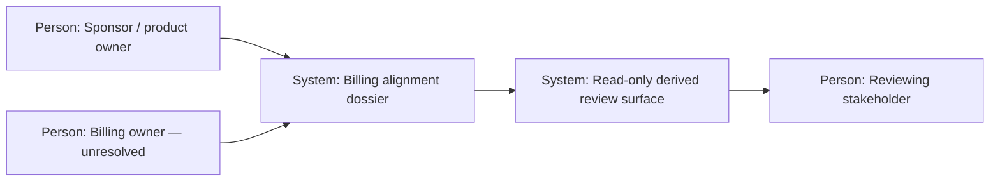

---
{"artifact":"context","entities":[]}
---
# System context

| Element | Responsibility | Supports | Open concern |
| --- | --- | --- | --- |
| Sponsor / product owner | States product outcome and reviews alignment | `UC-001`, `SCN-001` | Does not automatically own billing policy |
| Billing owner | Define/authorize billing rules | `UC-001`, `SCN-002` | Role unresolved (`Q-001`) |
| Billing alignment dossier | Canonical evidence and uncertainty record | `UC-001` | Must not invent rules (`Q-002`) |
| Read-only derived review surface | Presents dossier and exact snapshot | `SCN-001` | Presentation is not a decision channel (`Q-003`) |
