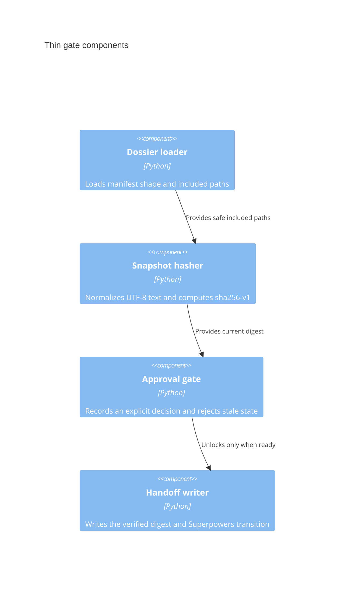

# Thin gate component view

```mermaid
C4Component
  title Thin gate components
  Component(loader, "Dossier loader", "Python", "Loads manifest shape and included paths")
  Component(snapshot, "Snapshot hasher", "Python", "Normalizes UTF-8 text and computes sha256-v1")
  Component(approval, "Approval gate", "Python", "Records an explicit decision and rejects stale state")
  Component(handoff, "Handoff writer", "Python", "Writes the verified digest and Superpowers transition")
  Rel(loader, snapshot, "Provides safe included paths")
  Rel(snapshot, approval, "Provides current digest")
  Rel(approval, handoff, "Unlocks only when ready")
```

Semantic document quality remains outside these components and belongs to skill review plus the human decision.
