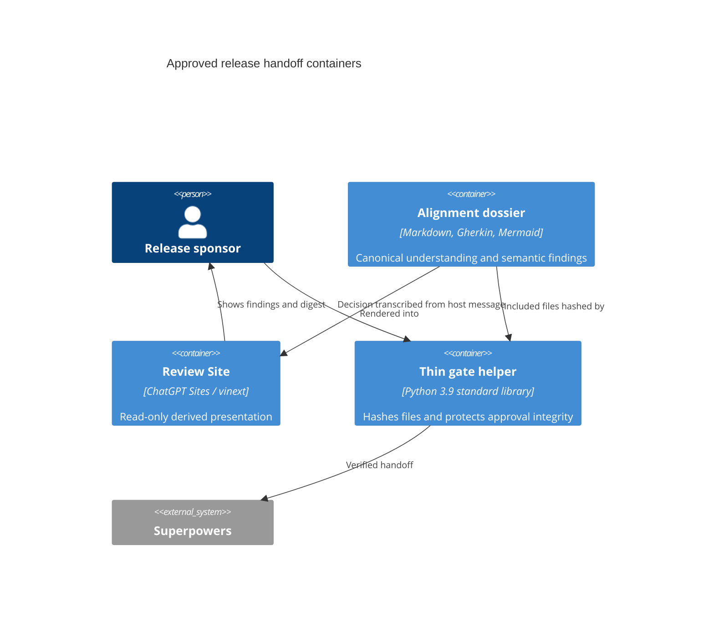

# Container view

```mermaid
C4Container
  title Approved release handoff containers
  Person(sponsor, "Release sponsor")
  Container(dossier, "Alignment dossier", "Markdown, Gherkin, Mermaid", "Canonical understanding and semantic findings")
  Container(site, "Review Site", "ChatGPT Sites / vinext", "Read-only derived presentation")
  Container(helper, "Thin gate helper", "Python 3.9 standard library", "Hashes files and protects approval integrity")
  System_Ext(superpowers, "Superpowers")
  Rel(dossier, site, "Rendered into")
  Rel(dossier, helper, "Included files hashed by")
  Rel(site, sponsor, "Shows findings and digest")
  Rel(sponsor, helper, "Decision transcribed from host message")
  Rel(helper, superpowers, "Verified handoff")
```

The Site has no persistence or approval mutation. The helper has no semantic parser.
