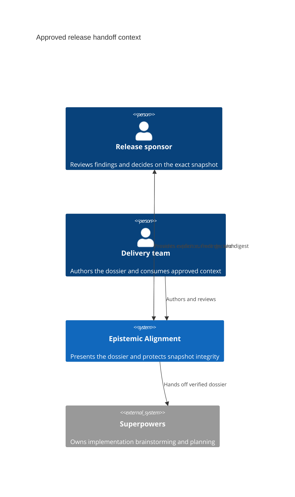

# System Context

```mermaid
C4Context
  title Approved release handoff context
  Person(sponsor, "Release sponsor", "Reviews findings and decides on the exact snapshot")
  Person(team, "Delivery team", "Authors the dossier and consumes approved context")
  System(alignment, "Epistemic Alignment", "Presents the dossier and protects snapshot integrity")
  System_Ext(superpowers, "Superpowers", "Owns implementation brainstorming and planning")
  Rel(team, alignment, "Authors and reviews")
  Rel(alignment, sponsor, "Presents evidence, findings, and digest")
  Rel(sponsor, alignment, "Provides explicit current decision")
  Rel(alignment, superpowers, "Hands off verified dossier")
```

The sponsor owns the decision. Epistemic Alignment owns presentation and mechanical snapshot checks, while Superpowers owns downstream implementation work.
