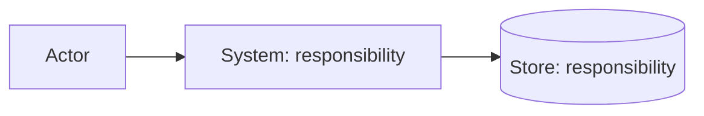

# C4 and ADR recipe

Use Mermaid source with a nearby prose responsibility map. Start with system context; add containers when deployables or stores matter; add components only where internal structure changes a material behavior or decision.

```markdown
# <View>


| Element | Responsibility | Supports | Open concern |
| --- | --- | --- | --- |
| System | ... | UC-001 / SCN-001 | ... |
```

For each material choice, create `decisions/ADR-<id>.md`:

```markdown
# ADR-<id>: <decision>
Status: proposed|accepted|superseded
Context: <forces and links>
Decision: <choice>
Consequences: <benefits, costs, risks>
Alternatives: <considered options>
```
