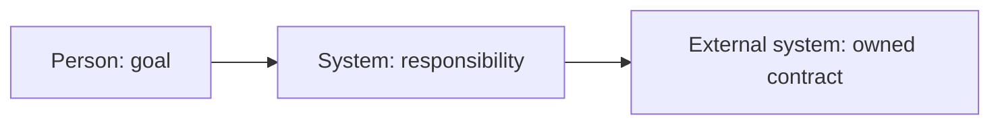

# C4 responsibility and ADR method

C4 provides zoom levels for communicating software structure. Use only the depth needed to explain responsibilities and decisions.

## Level selection

| Level | Question answered | Include when |
| --- | --- | --- |
| System context | Who uses the system, what is its boundary, and what external systems matter? | Always for a software system |
| Containers | Which deployable/runtime/store responsibilities collaborate? | Deployment, data, trust, ownership, or operations matter |
| Components | How is one container's material responsibility divided? | The split affects behavior, risk, ownership, or an ADR |
| Code | How is it implemented? | Outside alignment; downstream design only |

## Diagram and prose pair

```markdown


| Element | Responsibility | Supports | Owns / exchanges | Failure / recovery | Open concern |
| --- | --- | --- | --- | --- | --- |
```

The prose/table is required because diagrams compress nuance and may not render.

## Modeling rules

- Give every element one concise responsibility, not a technology label alone.
- Show relationships with purpose or information exchanged.
- Show ownership and trust boundaries where they drive decisions.
- Link elements to `UC-*`, `SCN-*`, constraints, or ADRs.
- Model current/proposed state explicitly; do not blend them.
- Exclude speculative components that do not explain a behavior or decision.
- Keep one abstraction level per view.

## Scenario walk

For each architecture-driving scenario trace:

1. entry actor/event;
2. responsibility owner at each boundary;
3. authoritative state and consistency needs;
4. external dependency and failure mode;
5. recovery, notification, and audit responsibility;
6. stakeholder-visible result.

Missing ownership, duplicated ownership, or unexplained hand-offs become questions/findings.

## Architecture decision record

```markdown
# ADR-<id>: <decision>

Status: proposed | accepted | superseded
Date:
Decision owner:

## Context and drivers
<forces, constraints, scenarios, and evidence>

## Decision
<specific allocation, boundary, dependency, or policy choice>

## Alternatives considered
- <alternative and why it was not selected>

## Consequences
### Benefits
### Costs and trade-offs
### Risks and mitigations

## Assumptions and validation
<what could invalidate the decision and how it will be learned>

## Traceability
<UC / SCN / C4 / finding links>
```

Create an ADR for choices that are costly to reverse, allocate ownership, change public contracts, introduce major dependencies, or materially affect quality/trust/data boundaries. Do not create ADRs for routine implementation details.

## Common mistakes

- boxes named only by frameworks;
- database-as-architecture with behavior/ownership omitted;
- context and components mixed in one graph;
- arrows without purpose;
- diagram implies a decision while ADR remains proposed;
- every scenario mapped to a separate service;
- nonfunctional requirements listed without an owning responsibility;
- components added because C4 has a component level, not because the level helps.
