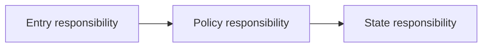

# C4 components

## Scope

- Container being decomposed:
- Material reason for component detail:
- Related scenarios / decisions:

## Component view

## Responsibility map

| Component | Responsibility | Inputs / outputs | Supports | Depends on | Failure / open concern |
| --- | --- | --- | --- | --- | --- | --- |

## Ownership walk

<!-- Walk priority scenarios through components and identify missing or duplicated responsibility. -->

## Decision boundary

<!-- Stop before classes/functions. Link material choices to ADRs. -->
