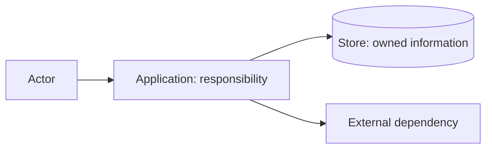

# C4 containers

## Scope and drivers

<!-- Explain why a container view is useful and which behaviors/qualities drive it. -->

## Container view

## Responsibility map

| Container | Responsibility | Technology constraint (if fixed) | Owns / consumes | Supports | Failure / recovery | Owner / concern |
| --- | --- | --- | --- | --- | --- | --- |

## Important interactions

| From → to | Purpose | Contract / data | Trust or consistency concern | Related scenarios |
| --- | --- | --- | --- | --- |

## Decisions and unknowns

<!-- Link ADRs; do not present proposed boundaries as accepted. -->
