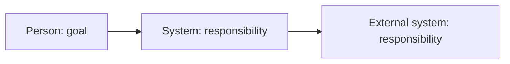

# C4 system context

## Purpose and boundary

- Software system under design:
- Primary responsibility:
- Inside the boundary:
- Outside the boundary:
- Architecture drivers:

## Context view

## People and external systems

| Element | Type / owner | Responsibility or goal | Relationship / information | Supports | Trust / open concern |
| --- | --- | --- | --- | --- | --- |

## Boundary decisions and unresolved questions

<!-- Link assumptions, contradictions, and ADRs. -->
